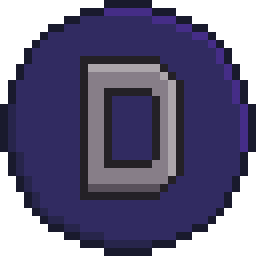

<p align="center"></p>

# Portal  Dimensions
A game closed at the alpha stage due to too much ambition with little resources (one unfortunate student). Even if work on it ever resumes, it will be a completely different game, written from scratch.

# Run source code on local machine

- Install [Unity Hub](https://unity3d.com/en/get-unity/download)
- Clone repository

```shell
git clone https://github.com/Nytrock/PortalDimensions.git
```
- Open Unity Hub, click on the `Add project` button, select the folder where the repository was cloned
- Click on the created project and start studying the code
